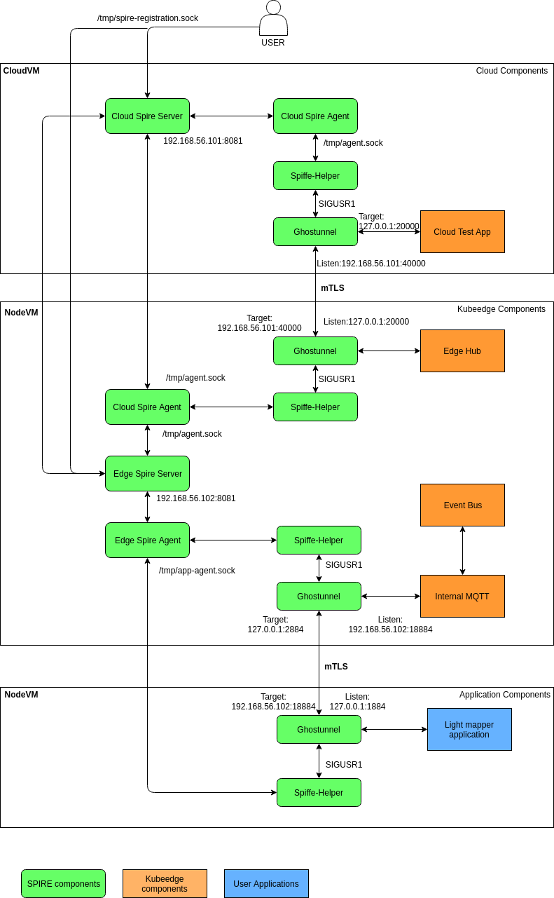
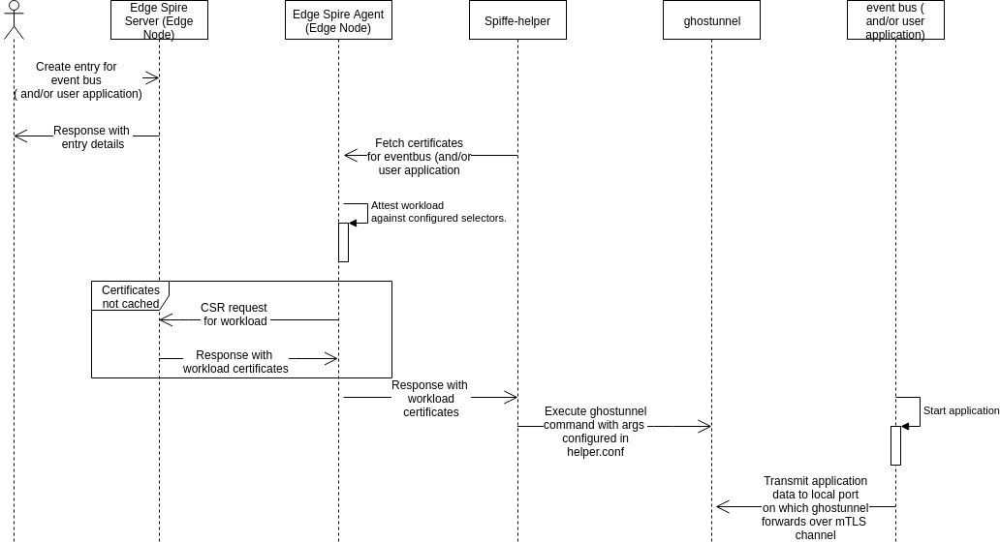

# Identity Management Using SPIRE for Kubeedge

## Background

Security is a paramount requirement for edge computing architecture as security breaches can make a complete organization to come to a halt (IIot) , data breach can lead to privacy issues and also control of the complete edge computing infrastructure. 

To enable better security, following needs to be satisfied for kubeedge framework
* Only verified and authorized edge nodes should be able to join cluster and connect to cloud.
* Applications connecting to edge computing framework should be verified against the assigned identities.
* Applications should be authorized to send and receive data from edge computing framework.
* Certificate rotation should be possible at each service-level.
* Audit at service-level for all communciation between services.

## SPIFFE and SPIRE

The Secure Production Identity Framework For Everyone (SPIFFE) Project defines a framework and set of standards for identifying and securing communications between services.
SPIFFE enables enterprises to transform their security posture from just protecting the edge to consistently securing all inter-service communications deep within their applications.
SPIFFE recommends industry standards like TLS and JWT for forming a identity document for every service. The service-level identity AuthN and AuthZ removes the dependency of complex network-level ACL strategies.

More information about SPIFFE can be found at [*https://github.com/spiffe/spiffe*](https://github.com/spiffe/spiffe).

SPIRE (SPIFFE Runtime Environment) is a reference implementation of SPIFFE specification. SPIRE manages identities for node and workloads.
 It provides API for controlling attestation policies and identity issuance and rotation strategies.

More information about SPIRE can be found at [*https://github.com/spiffe/spire*](https://github.com/spiffe/spire).

## Benefits

* Node attestation: Only verifiable edge nodes can join the edge clusters. Every node is issued an identity on verification.
 In case of failed node attestations, no identity documents can be issued for services running on the node.

* Workload attestation: Only verifiable workload can run on edge nodes. In case of failed workload attestations, there are no identities issues for the workloads.
All communications are blocked from unverified workloads.

* Certificate rotation: Short-lived certificates are generated and rotation policies can be configured for every service communication.
There is no need for custom agents and reliance on specific orchestrators for certificate rotation configuration and management.

* Automated non-root CA certificate heirarchical deployments: Edge spire servers can be configured to not share any root CA chain for downstream nodes and workloads.

## SPIRE-based Identity Management Reference Architecture

Goal of this example is to achieve workload identity management for
cloud and edge processes . A reference architecture is shown below. A
list of things to-do is listed below in version information section.
For further integration , an extension add-on will be developed
integrated with kubeege for the same.

## Functional sequence diagrams

### Cloud component sequence
1\. Start cloud spire server.

2\. Generate token for node with spiffeID association for cloud node. (e.g: spiffe id = spiffe://example.org/upstream-cloud-node).

3\. Start spire agent with generated token. Node attestation is performed.

4\. Create entry with cloud spire server for cloud component (cloudapp in this example). The entry is associated with node spiffeID and selectors used for attestation of cloud component.

5\. Start spiffe-helper with helper.conf configuration. Spiffe-helper fetches certificates and starts ghostunnel. Spiffe-helper also updates the certificates and signals (SIGUSR1) to ghostunnel to reload certificates. Workload attestation is performed.

6\. Start cloud component. Cloud component uses localhost ip and port to transfer data. Ghostunnel fetches data from this port and securely sends the data to peer ghostunnel.

7\. SpiffeIDs are validated by ghostunnel to control authorization by using tls peer verification method. Authorized spiffeID are configured as arguments to ghostunnel in helper.conf.

### Edge component sequence

1\. Generate token for edge with spiffeID association for edge node. (e.g:spiffe id = spiffe://example.org/upstream-edge-node).

2\. Start spire agent (cloud spire agent) on edge node with configuration to connect to cloud spire server and associated token. Node attestation is performed.

3\. Create entry with cloud spire server for edge component. The entry is associated with node spiffeID and selectors used for attestation of edge component.

4\. Start edge spire server. Edge spire server starts with upstreamCA configured to cloud spire server.

5\. Edge spire server fetches certificate from cloud spire agent (running on edge node) which invokes workload attestation and receives workload certificates in response.

6\. Edge spire server connects to cloud spire server using workload certificates to fetch intermediate CA using spire node api.

7\. Generate token for edge with spiffeID association for edge node. (e.g:spiffe id = spiffe://example.org/downstream-edge-node).

8\. Start edge spire agent on edge node with configuration to connect to edge spire server and associated token. Node attestation is performed.

9\. Start spiffe-helper. Spiffe-helper fetches workload certificate for edge component (edge-hub) from cloud spire agent (running on edge node) and starts ghostunnel. Spiffe-helper also updates the certificates and signals (SIGUSR1) to ghostunnel to reload certificates. Workload attestation is performed.

10\. Start edge-hub (execute edge_core binary). Edge-hub uses localhost ip and port to transfer data. Ghostunnel fetches data from this port and securely sends the data to peer ghostunnel.

11\. SpiffeIDs are validated by ghostunnel to control authorization by using tls peer verification method. Authorized spiffeID are configured as arguments to ghostunnel in helper.conf.

### Edge application sequence

1\. Create entry with edge spire server for edge applications (eventbus and lightmapper in this example). The entry is associated with edge node spiffeID (token parameter used to register edge spire agent) and selectors used for attestation of edge application.

2\. Start spiffe-helper with helper.conf configuration (refer event-bus-helper.conf/user-app-helper.conf files). Spiffe-helper fetches certificates and starts ghostunnel. Spiffe-helper also updates the certificates and signals (SIGUSR1) to ghostunnel to reload certificates. Workload attestation is performed.

3\. Start edge applications. Edge application uses localhost ip and port to transfer data. Ghostunnel fetches data from this port and securely sends the data to peer ghostunnel.

4\. SpiffeIDs are validated by ghostunnel to control authorization by using tls peer verification method. Authorized spiffeID are configured as arguments to ghostunnel in helper.conf.

## Source Folders
* release : Directory has configurations and scripts to be used for deployment of identity management infrastructure for Kubeedge.

* app-agent-conf  : Configurations for spire agent interfacing with edge (event-bus) and user applications . Spire agent communicates to edge spire server.

* conf : Configurations for spire server (cloud and edge) and spire agent (agent communicating to cloud spire server).

* certs : Spiffe helper communicates with spire agents and download certificates in this folder . Ghostunnel is loaded with these certificates . For edge to user interface application , spiffe helper configuration and ghostunnel certs are present in event-bus and user-app folders respectively.

* app-binaries : All binaries for edge , cloud and test applications.

* log : Logs for different processes run as part of the example.

## Scripts
* deploy-cloud.sh : Deploys cloud part of identity management infrastructure. Used to 
                    
                    1) Start cloud spire server.                           
                    2) Registers cloud node and cloud agent.                           
                    3) Registers and starts cloud hub (test cloud hub command simulator).

* deploy-edge.sh  : Deploys edge part of identity management infrastructure.
                           
                    1) Registers edge node and edge agent communication with cloud spire server.                 
                    2) Registers and starts edge spire server.                           
                    3) Registers and starts edge agent for edge to user app communication interface.
                    
* start-spiffe-helper.sh  : Based on the configuration (helper.conf) , starts spiffe-helper communication for certificate download and rotation. Ghostunnel is run using spiffe-helper.
* commands.sh  : Abstracts spire cli commands.
 
## Prerequisites
* Bash version 4.4.19
* Go compiler version 1.11.4
* Go dep and glide package managers
* sshpass
* Kubernetes installation based on the kubeedge installation [*https://github.com/kubeedge/kubeedge#install-kubernetes*](https://github.com/kubeedge/kubeedge#install-kubernetes)

## How to configure
### Cloud node configuration

*Upstream CA – Cloud spire server configuration:*
&lt;SPIRE\_PATH&gt;/conf/server/server.conf

*Upstream CA Agent – Cloud node agent configuration :*
&lt;SPIRE\_PATH&gt;/conf/agent/agent.conf

Following fields might require modification based on the deployment environment

    bind_address = "192.168.56.101" <Cloud node vm IP>
    server_address = "192.168.56.101" <Cloud Spire Server IP>
    server_port = "8081" <Cloud Spire Server port>
    socket_path =/tmp/agent.sock"

### Edge node configuration

*Edge agent configuration to **connect to cloud spire server** :*
&lt;SPIRE\_PATH&gt;/conf/agent/agent.conf

Following fields might require modification based on the deployment environment

    bind_address = "192.168.56.102"
    bind_port = "8088"
    data_dir = "./.data"
    server_address = "192.168.56.101" // <Cloud spire server IP>
    server_port = "8081" // <Cloud spire server port>
    socket_path ="/tmp/upstream_agent.sock"

*Edge spire server configuration :*
&lt;SPIRE\_PATH&gt;/conf/server/server.conf

    UpstreamCA "spire" {
    plugin_data {
      server_address = "192.168.56.101" // <Cloud spire server IP>
      server_port = 8081 // <Cloud spire server port>
      workload_api_socket = "/tmp/upstream\_agent.sock"
    }

*Edge application agent configuration to connect to edge spire server :
&lt;SPIRE\_PATH&gt;/conf/app-agent-conf/agent/agent.conf*

    bind_address = "192.168.56.102"
    bind_port = "9088"
    data_dir = "./.app-data"
    server_address = "192.168.56.102" // <Edge spire server IP>
    server_port = "8081" // <Edge spire server port>
    socket_path ="/tmp/app-agent.sock"

### Spiffe helper configuration (IMPORTANT)

Spiffe helper is used to execute ghostunnel for creating communciation
channel over TLS for cloud , edge and user workloads . Please refer to
the specific configurations in the folders section.

All the helper configurations need to be updated with IP addresses and
ports as per the deployment in

1\. &lt;SPIRE\_PATH&gt;/helper.conf

2\. &lt;SPIRE\_PATH&gt;/event-bus/event-bus-helper.conf

3\. &lt;SPIRE\_PATH&gt;/user-app/user-app-helper.conf

In the list of To-Dos , there is an item to generate these
configurations automatically based on environment configuration to avoid
errors.

Following is a sample configuration for kubeedge event-bus interface which invokes ghostunnel in server mode:

    agentAddress = "/tmp/app-agent.sock"
    cmdArgs = "**server** --listen 192.168.56.102:18884 --target 127.0.0.1:2884 --cacert /opt/spire/event-bus/certs/svid\_bundle.pem --keystore /opt/spire/event-bus/certs/new\_bundle.p12 **--allow-uri-san spiffe://example.org/downstream-app-event-bus**"
    cmd = "/opt/spire/ghostunnel"
    certDir = "/opt/spire/event-bus/certs"
    renewSignal = "SIGUSR1"
    svidFileName = "svid.pem"
    svidKeyFileName = "svid\_key.pem"
    svidBundleFileName = "svid\_bundle.pem"

Following is a sample configuration for user-app interface which invokes ghostunnel in client mode:

    agentAddress = "/tmp/app-agent.sock"
    cmdArgs = "client --listen 127.0.0.1:1884 --target 192.168.56.102:18884 --cacert /opt/spire/user-app/certs/svid_bundle.pem --keystore /opt/spire/user-app/certs/new_bundle.p12 --verify-spiffe-id spiffe://example.org/downstream-app-event-bus"
    cmd = "/opt/spire/ghostunnel"
    certDir = "/opt/spire/user-app/certs"
    renewSignal = "SIGUSR1"
    svidFileName = "svid.pem"
    svidKeyFileName = "svid_key.pem"
    svidBundleFileName = "svid_bundle.pem"

### Script Configurations

Environment variable configurations : &lt;SPIRE\_PATH&gt;/edge.env

    export CLOUD\_VM\_USER=vm1
    export CLOUD\_VM\_PASS=vm1
    export CLOUD\_VM\_IP=192.168.56.101
    export SPIRE\_PATH=/opt/spire

## How to setup and use

1\. Copy the release files to cloud node and edge node at path /opt/spire/.

2\. Update the IP , port and spire path in the above listed configurations.

3\. Create an edge node using kubectl using the steps provided at [*https://github.com/kubeedge/kubeedge#run-as-a-binary-1*](https://github.com/kubeedge/kubeedge#run-as-a-binary-1).

4\. In cloud node , execute deploy-cloud.sh.

5\. In edge node , execute deploy-edge.sh. Edged reports ready status to edgecontroller. To verify node status, in cloud vm, execute

    `kubectl get nodes`

6\. Register an example device with cloud using following command. Please
note, in the current version, cloud test application opens 30000 port
for metadata creation (create pod or device) and 20000 port for
communication with kubeedge edgehub. In cloud node, execute

    `curl -XGET http://127.0.0.1:30000/device -H 'content-type:application/json' -d@/opt/spire/app-binaries/test-device.yaml`

7\. Run the light\_mapper application from app\_binaries in edge node. Light mapper
application is a binary built from
[*https://github.com/kubeedge/examples/tree/master/led-raspberrypi*](https://github.com/kubeedge/examples/tree/master/led-raspberrypi).
Usage of the application can be referred in the same page.

For spire server cli usage , please refer to
[*https://github.com/spiffe/spire*](https://github.com/spiffe/spire).

## Present support

1\. Initial infrastructure deployment.

2\. 1-1 cloud and edge node. Multiple edge nodes are not supported in
scripts.

3\. Communication from user application and edge application using
certificates issued by cloud spire server and edge spire server.

4\. Supports kubeedge v0.2.

## ToDo

1\. Optimization for redundancies in configuration and scripts.

2\. Test and support upstream\_bundle=false to prune rootCA at edge spire server.

3\. Auto-generate configurations (partially) based on environment
information.

4\. Trusted cloud spire server for communication between edge spire agents, edge spire server, cloud spire agent and cloud spire server.

5\. Secure communication between event bus and internal mqtt server.
